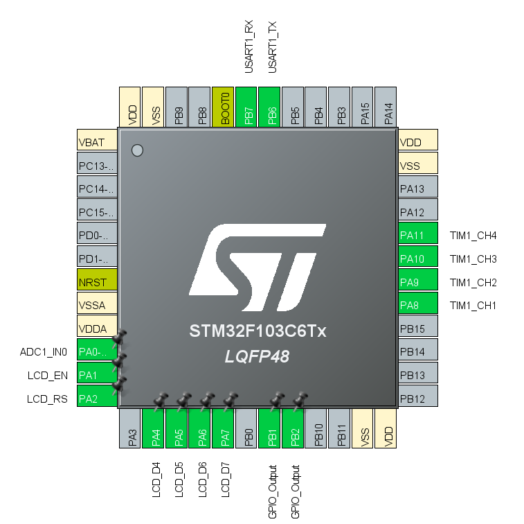
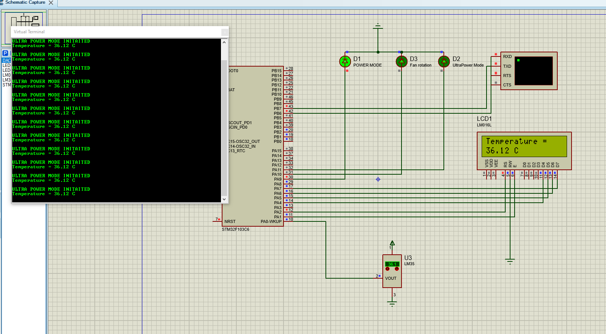

## Project description 

This objective of the project is to design a smart water spraying fan that start spraying water according to the conditions around it such as temperature.

The main idea of the project comes from a real-life example that exists in Mecca, Saudi Arabia. The weather in Mecca has usually high average temperature and humidity and with such a huge amount of people every day this application is a great solution to this issue.
Video about the implementation can be found here https://youtu.be/D18PFyJWhNQ.

The knowledge and experience surrounding a set of tools that were cultivated throughout the semester were used in the development of this project:
Microcontrollers and C language development. The experience also surrounded understanding the working principle of LCD screens. The USART provided the help needed with developmental communications. Timers, such as PWD and Output Compare, were also utilized in the development of this project.

## Design steps

The first step of the design was to look for the best sensor for such a project. I experimented with many different sensors and decided to stick with the simple temperature sensor called LM35. After initializing the base of the project, I tested the LM35 temperature sensor with an ADC and a GPIO and it worked. Then, I started working on USART communication in order to show the data on the virtual terminal. After that, I tried many different approaches for the LCD screen and in the end it worked perfectly. Moreover, I used PWD timer to showcase when the Power mode is triggered using channel 2 in the timer and PA9 on the board. I also used PWD to showcase the constant rotation of the fan where it will keep rotating for 2/3 cycles of 63999 counter period which equals to 42666. Afterwards, I used the Output capture in the timer in channel 4 and PA11 on the board to showcase when the UltraPower mode is triggered using LEDs.

## Project report
 - You can find all the detailed information regarding this project .
## Screenshots

### STM32 microcontroller stepup

### Protues simulation

